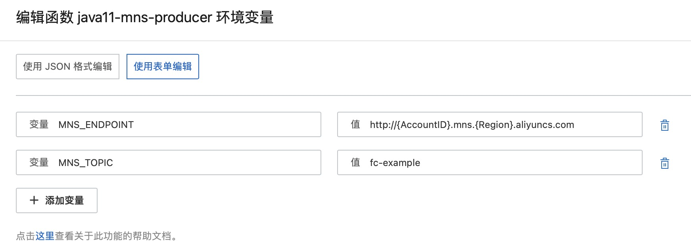

# java11 消息服务 MNS 主题模型生产者示例

本示例为您展示了Java runtime的 [消息服务MNS](https://help.aliyun.com/document_detail/27414.html) 主题模型生产者示例。
本示例使用了MNS的主题模型作为示例，与函数计算中的MNS主题触发器一起实现了消息服务的生产者-消费者模型。
MNS的配置在函数的环境变量配置中（参考s.yaml)。

> 若使用队列模型，请参考java11-mns-queue-producer示例。

本示例使用 [MNS官方Java SDK](https://help.aliyun.com/document_detail/27507.html)。

## 准备开始
- 一个可用的mns主题，可参考MNS官方文档[主题模型快速入门-创建主题](https://help.aliyun.com/document_detail/34424.html) 创建。
- 有MNS权限的RAM用户
  - 建议直接使用函数计算默认的角色 AliyunFCDefaultRole
  - 也可参考MNS官方文档[开通消息服务MNS并授权](https://help.aliyun.com/document_detail/27423.html)，函数计算需要该RAM密钥访问MNS主题。
- [可选] 安装并配置 Serverless Devs 工具。（https://help.aliyun.com/document_detail/195474.html）

## 快速开始

### 方式一、使用控制台创建

#### 1. 编译打包

```shell
# 编译部署
mvn package
# 打包文件
cd target && zip -r java11-mns-topic-producer.zip *
```

#### 2. 创建函数
选择服务（或创建服务）后，单击创建函数，如图所示
- 选择 `从零开始创建`
- 填入函数名称
- 选择运行环境 java11/java8
- 选择函数触发方式：通过事件请求触发
- 其他设置使用默认


> 详细创建函数流程见文档: [使用控制台创建函数](https://help.aliyun.com/document_detail/51783.html)

#### 3. 设置initializer/preStop回调函数配置和环境变量配置

回调函数配置：


环境变量配置：


#### 4. 设置服务角色配置
在编辑服务页面，选择服务角色，推荐选择函数计算默认设置的角色 AliyunFCDefaultRole。
也可以自定义服务角色，并添加权限策略AliyunMNSFullAccess，或自定义权限策略，详情见文档 [授权策略和示例](https://help.aliyun.com/document_detail/27447.html)


#### 5. 测试函数

返回结果如下所示
```bash
publish message succ, message id:3405CA51807661357FC76xxxxxxxxxx, message body 
```

### 方式二、使用 Serverless Devs 工具编译部署

#### 1. 修改 s.yaml 配置
- 根据需要修改 access 配置
- 修改 role 配置，角色需要有mns的读写权限，建议使用函数计算默认的role, `acs:ram::{AccountID}:role/aliyunfcdefaultrole`
- 修改 environmentVariables 配置，填入 MNS_ENDPOINT
- 使用 initialize 和 prestop 回调，需要在 s.yaml 中配置

```yaml
        initializationTimeout: 60
        initializer: example.App::initialize
        instanceLifecycleConfig:
          preStop:
            handler: example.App::preStop
            timeout: 60
```

#### 2. 安装依赖并部署

编译部署代码包
```shell
s deploy
```
> 注意: `pom.xml` 中有配置 `pre-deploy` 脚本 `mvn package`, 在部署前会调用 `mvn package` 编译打包。

#### 3. 调用测试

```shell
s invoke
```

调用函数时收到的响应如下所示：

```bash
========= FC invoke Logs begin =========
FC Initialize Start RequestId: 48941a58-7e8d-4b2f-8ddc-xxxxxxxxxx
2022-07-19 08:44:41.161 [INFO] [48941a58-7e8d-4b2f-8ddc-xxxxxxxxxx] init mns client time cost: 504ms
FC Initialize End RequestId: 48941a58-7e8d-4b2f-8ddc-xxxxxxxxxx
FC Invoke Start RequestId: c814ae3f-0ad6-409e-a4d0-xxxxxxxxxx
2022-07-19 08:44:52.080 [INFO] [c814ae3f-0ad6-409e-a4d0-xxxxxxxxxx] publish message succ, message id:3405CA51807661357FC76xxxxxxxxxx, message body md5:D56E8E0A94F7B385AE1xxxxxxxxxx
FC Invoke End RequestId: c814ae3f-0ad6-409e-a4d0-xxxxxxxxxx

Duration: 348.41 ms, Billed Duration: 349 ms, Memory Size: 256 MB, Max Memory Used: 128.43 MB
========= FC invoke Logs end =========

FC Invoke instanceId: c-62d66ef7-5bcb408bxxxxxxxxxx

FC Invoke Result:
publish message succ, message id:3405CA51807661357FC76xxxxxxxxxx, message body md5:D56E8E0A94F7B385AE1xxxxxxxxxx


End of method: invoke
```

## 注意事项
1. MNS消息服务和函数计算建议部署在同一个地域
