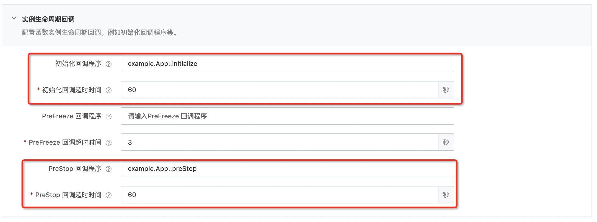
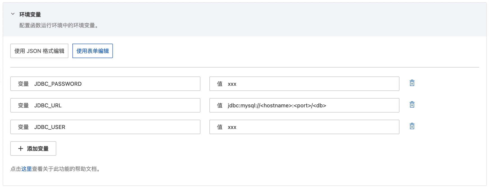

# java11 mysql示例

本示例为您展示了Java runtime的mysql使用示例。
在本示例中，mysql数据库配置在函数的环境变量配置中（参考s.yaml)，initializer 回调函数从环境变量中获取数据库配置，创建mysql连接，preStop 回调函数负责关闭mysql连接。

本示例使用MySQL Connector/J 8.0版本，支持MySQL 5.7 and 8.0，版本兼容详情见 https://dev.mysql.com/doc/connector-j/8.0/en/connector-j-versions.html。

> MySQL Connector/J 8.0 Developer Guide: https://dev.mysql.com/doc/connector-j/8.0/en/ 

## 准备开始
- 一个可用的mysql数据库，可以参考以下sql创建表并插入测试数据

```sql
CREATE TABLE `users` (
  `id` bigint(20) unsigned NOT NULL AUTO_INCREMENT,
  `name` varchar(20) NOT NULL,
  `age` tinyint(11) NOT NULL DEFAULT '0',
  PRIMARY KEY (`id`)
) ENGINE=InnoDB DEFAULT CHARSET=utf8;

INSERT INTO `users` (`id`, `name`, `age`) VALUES
(1, '张三', 18),
(2, '李四', 28);
```

- [可选] 安装并配置 Serverless Devs 工具。（https://help.aliyun.com/document_detail/195474.html）

## 快速开始
### 方式一、使用 Serverless Devs 工具编译部署

#### 1. 修改 s.yaml 配置
- 根据需要修改 access 配置
- 修改 environmentVariables 配置，填入 JDBC_URL, JDBC_USER 和 JDBC_PASSWORD
- 使用 initialize 和 prestop 回调，需要在 s.yaml 中配置

```yaml
        initializationTimeout: 60
        initializer: example.App::initialize
        instanceLifecycleConfig:
          preStop:
            handler: example.App::preStop
            timeout: 60
```

#### 2. 安装依赖并部署

编译部署代码包
```shell
s deploy
```
> 注意: `pom.xml` 中有配置 `pre-deploy` 脚本 `mvn package`, 在部署前会调用 `mvn package` 编译打包。

#### 3. 调用测试

```shell
s invoke
```

调用函数时收到的响应如下所示：

```bash
FC Initialize Start RequestId: 9f22c9a2-8ec6-45ba-bdd1-f586b2832439
FC Initialize End RequestId: 9f22c9a2-8ec6-45ba-bdd1-f586b2832439
FC Invoke Start RequestId: 209ece4d-c26b-42da-871a-21d38fc0d7be
2022-04-11 02:38:32.008 [INFO] [209ece4d-c26b-42da-871a-21d38fc0d7be] get user: {name=张三, id=1, age=18}
FC Invoke End RequestId: 209ece4d-c26b-42da-871a-21d38fc0d7be

Duration: 87.02 ms, Billed Duration: 88 ms, Memory Size: 128 MB, Max Memory Used: 92.02 MB
========= FC invoke Logs end =========

FC Invoke Result:
{name=张三, id=1, age=18}


End of method: invoke
```

### 方式二、使用控制台创建

#### 1. 编译打包

```shell
# 编译部署
mvn package
# 打包文件
cd target && zip -r java11-mysql.zip *
```

#### 2. 创建函数
选择服务（或创建服务）后，单击创建函数，如图所示
- 选择 `从零开始创建`
- 填入函数名称
- 选择运行环境 java11/java8
- 选择函数触发方式：通过事件请求触发
- 其他设置使用默认


> 详细创建函数流程见文档: [使用控制台创建函数](https://help.aliyun.com/document_detail/51783.html)

#### 3. 设置initializer/preStop回调函数配置和环境变量配置

回调函数配置


环境变量配置



#### 4. 测试函数

返回结果如下所示
```bash
{name=张三, id=1, age=18}
```

## 数据库访问限制
当使用云数据库时，一般都会有访问控制，比如阿里云数据库RDS中的白名单设置（ [RDS白名单设置说明](https://help.aliyun.com/document_detail/43185.html?spm=5176.19908528.help.dexternal.6c721450iLu0jH) )。

如果仅仅作为测试，可以将白名单配置成 `0.0.0.0/0`。（不要在生产环境使用!)

在生产环境，可以使用以下两种方式访问：

1. VPC方式（**推荐**） <br>
   参考文档：https://help.aliyun.com/document_detail/84514.html
2. 代理方式<br>
   参考文档：https://help.aliyun.com/document_detail/91243.html
3. 
## 备注
1. 本示例不是连接池方式，若要使用连接池，可以参考文档 [Connection Pooling with Connector/J](https://dev.mysql.com/doc/connector-j/8.0/en/connector-j-usagenotes-j2ee-concepts-connection-pooling.html)
