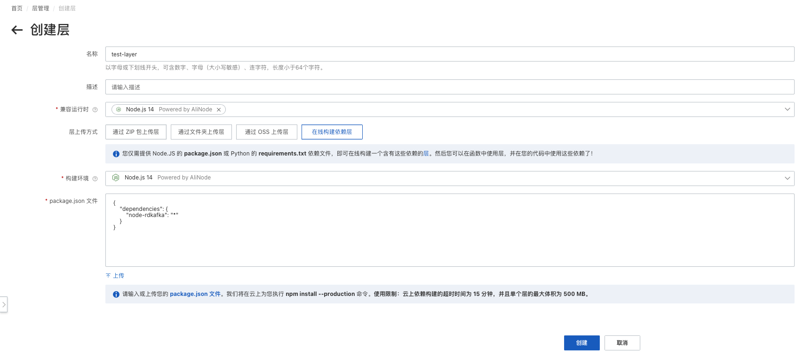

# Nodejs14 Kafka消息队列生产者示例

本示例为您展示了 Nodejs14 的 [消息队列Kafka](https://help.aliyun.com/document_detail/68151.html?spm=5176.167616.J_5253785160.5.2dfe6feexRPqMj) 生产者示例。（消费者示例见Kafka触发器示例）

本示例使用[消息队列Kafka版官方Nodejs SDK](https://help.aliyun.com/document_detail/184266.html)。

 ## 准备开始

 - 一个可用的Kafka消息队列，可参考消息队列Kafka版官方文档[消息队列快速入门](https://help.aliyun.com/document_detail/99949.html)。

   - 创建VPC专有网络（推荐在生产环境中也使用VPC），可参考[VPC官方文档](https://help.aliyun.com/document_detail/65398.htm?spm=a2c4g.11186623.0.0.61be4c9d4aGfpg#task-1012575)。VPC控制台[链接](https://vpcnext.console.aliyun.com/)。至此即可拥有VPC和相应交换机。

   > 部署Kafka实例时会提示创建可用的VPC专有网络

 - [可选] 安装并配置 Serverless Devs 工具。(https://help.aliyun.com/document_detail/195474.html)

 ## 快速开始

 ### 方式一. 使用控制台创建

#### 1. 安装依赖和部署代码包

对于Nodejs，建议使用`层`部署依赖包。

在函数计算控制台左侧菜单栏的高级功能中选中`层管理`。兼容运行时选择Nodejs14，层上传方式选择`在线构建依赖层`，将package.json文件复制进去。最后等待层创建完毕即可。



对于代码只需在code目录下打包压缩即可：

```shell
zip code.zip -r ./*
```


 #### 2. 创建服务

推荐在Kafka实例相同Region创建服务。

创建服务时在`高级选项`中`服务角色`选择AliyunFcDefaultRole（如没有则根据提示创建相应角色），并开启`允许访问VPC`，选取创建Kafka实例时所选择的`专有网络`、`交换机`与对应的`安全组(Kafka实例部署后自动创建)`。


#### 3. 创建函数

  创建服务后，单击创建函数，如图所示

 - 选择 `使用标准 Runtime 从零创建`
 - 填入函数名称
 - 代码上传方式选择`通过zip包上传代码`上传相应代码压缩包
 - 选择运行环境Nodejs 14
 - 选择函数触发方式：通过事件请求触发
 - 其他设置使用默认

 > 详细创建函数流程见文档: [使用控制台创建函数](https://help.aliyun.com/document_detail/51783.html)


#### 4. 配置环境变量、实例生命周期回调与层

在函数详情中的`函数配置`模块设置环境变量并在实例生命周期回调中配置Initializer 回调程序。

其中环境变量：

- bootstrap_servers设置为Kafka实例详情内`接入点信息`对应的`默认接入点`地址。
- topic_name设置为相应发送消息到的Topic（需要在Kafka消息队列版中提前创建）

Initializer设置为index.initialize；

层编辑添加之前构建好的依赖层。


 #### 5. 测试函数

 返回结果如下：

 ```bash
Finish sending the message:{
    "key1": "value1",
    "key2": "value2",
    "key3": "value3"
}
 ```

日志输出如下：

```bash
FC Initialize Start RequestId: 9b230404-4e05-49ca-a3d6-3be4629b367f
load code for handler:index.initialize
2022-07-31 14:30:31 9b230404-4e05-49ca-a3d6-3be4629b367f [verbose] Servers:  alikafka-pre-cn-7mz2sr1xa00c-1-vpc.alikafka.aliyuncs.com:9092
2022-07-31 14:30:31 9b230404-4e05-49ca-a3d6-3be4629b367f [verbose] TopicName:  HelloTopic
FC Initialize End RequestId: 9b230404-4e05-49ca-a3d6-3be4629b367f
FC Invoke Start RequestId: 3f19de00-ab31-48b4-a386-03cded9f97ee
load code for handler:index.handler
2022-07-31 14:30:31 3f19de00-ab31-48b4-a386-03cded9f97ee [verbose] connect ok
2022-07-31 14:30:36 3f19de00-ab31-48b4-a386-03cded9f97ee [verbose] delivery-report: producer ok
FC Invoke End RequestId: 3f19de00-ab31-48b4-a386-03cded9f97ee
```

 ### 方式二、使用 Serverless Devs 工具编译部署

 #### 1. 修改 s.yaml 配置

- 修改vpcConfig，将Kafka实例对应的VPC ID、安全组ID（可在**云服务器 ECS**控制台`网络与安全`菜单项找到）、vSwitchID填入。

- 修改 environmentVariables 配置，填入 bootstrap_servers 和 topic_name

 - 设置和Kafka实例相同的region

 #### 2. 安装依赖并部署

 安装依赖库

 ```shell
# 使用s工具安装依赖，需要使用 docker
s build --use-docker
 ```

 部署代码

 ```bash
s deploy -y
 ```

 #### 3. 调用测试

 ```shell
s invoke -e '{
    "Key": "test nodejs14 serverless devs"
}'
 ```

 调用函数时收到的响应如下所示：

 ```bash
========= FC invoke Logs begin =========
FC Initialize Start RequestId: f9f17f0b-62fb-4ffa-853a-67fb316e0bf1
load code for handler:index.initialize
2022-07-31T06:22:37.562Z f9f17f0b-62fb-4ffa-853a-67fb316e0bf1 [verbose] Servers:  alikafka-pre-cn-7mz2sr1xa00c-3-vpc.alikafka.aliyuncs.com:9092
2022-07-31T06:22:37.562Z f9f17f0b-62fb-4ffa-853a-67fb316e0bf1 [verbose] TopicName:  HelloTopic
FC Initialize End RequestId: f9f17f0b-62fb-4ffa-853a-67fb316e0bf1
FC Invoke Start RequestId: f9f17f0b-62fb-4ffa-853a-67fb316e0bf1
load code for handler:index.handler
2022-07-31T06:22:37.621Z f9f17f0b-62fb-4ffa-853a-67fb316e0bf1 [verbose] connect ok
2022-07-31T06:22:37.951Z f9f17f0b-62fb-4ffa-853a-67fb316e0bf1 [verbose] delivery-report: producer ok
FC Invoke End RequestId: f9f17f0b-62fb-4ffa-853a-67fb316e0bf1

Duration: 10006.34 ms, Billed Duration: 10007 ms, Memory Size: 128 MB, Max Memory Used: 53.24 MB
========= FC invoke Logs end =========

FC Invoke instanceId: c-62e61fad-012cb0b0300d462b817a

FC Invoke Result:
Finish sending the message:{
    "Key": "test nodejs14 serverless devs"
}


End of method: invoke
 ```

